# Portfolio 1 - The Wrestling Pub

## Introduction 

Welcome to my first project. The website is about a new wrestling bar in the heart of London. The website is a simple 3 tab url which will tell the user the information they need. That would be About/Menu and Contact me page.

I, as a big fan of wrestling thought this would be the perfect opportunity to make my first project wrestling based.

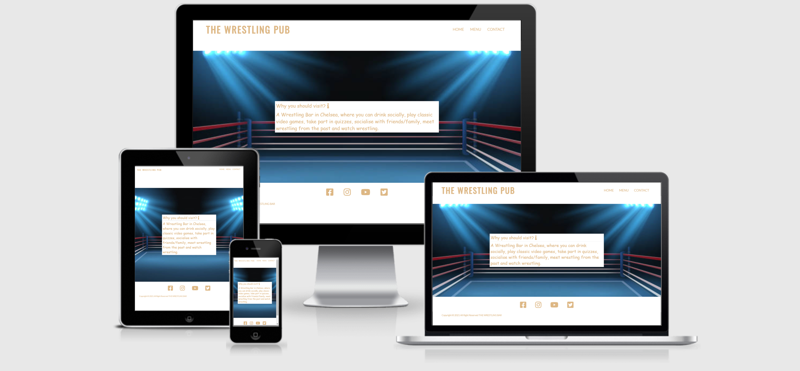

[Here is a link to my live site](https://nikhilkalhan92.github.io/The-Wrestling-Pub/)

## 1. Initial Design

### Final Design

[My Final design link is here](http://ami.responsivedesign.is/?url=https%3A%2F%2Fnikhilkalhan92.github.io%2FThe-Wrestling-Pub%2F#)

## Wireframes

 

### 2.User Experience

- I have realised for a while, London does not have many wrestling themed venus considering its a   massive hub for global wrestling companies. So this bar is perfect for the following people:

- wrestling fans who want to watch it with friends/family
- casual wrestling fans who want a fun spontanous night out
- People who like dressing up and gamers
- First dates!

### Aims
- In this project, I will build a static front-end site to present useful information to users, using all the technologies that I have learned about so far.

- Data is presented to help users achieve their goals, e.g. learning about a product/service in which   they   are interested. The presentation of this data advances the site owner's goals, e.g. helps them market a product/service.

- The site needs to be easy to use
- Moving the mouse around the site needs to be simple
- The site needs to provide the information needs when visiting the website ( About, Menu and contact details)
- Images that show what the bar looks like inside and the layout 

### Client Goals

- The site needs to be easily accessible.
- The navigation menu needs to be simple to use on a range of devices, including desktop, tablet and mobile.
- Manoeuvring around the site should be simple and straightforward.
- The site should be informative and all the text should be easy to read.
- The images should be clear and not stretched or squashed.

### First Time Visitors
- I want it to be easy to understand how to navigate throughout the site.
- I want the content to be easily read and understandable.

### Returning User
- To gather information for projects.
- To recommend the site to friends and family.
- To get in contact with us

### Design

### Color Scheme
The colours I have used are Burleywood and black. Both fitting colours which would suit the backgrounds on all three pages.

I feel like Burleywood suits the whole website, giving it the colour to attract the user at first glance.

Smokey background for the contact page, so its very easy to see the address and map of where the location is held

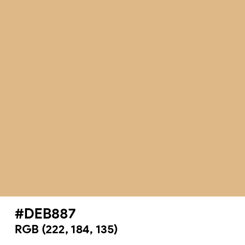

[Here is a link to my main color](https://www.color-name.com/burlywood.color)

### Features
1. Background color of menu bar and foreground color were chosen considering the contrast between background and foreground colours
2. Social media links (for facebook, Linkden, Twitter and Youtube) are placed at the bottom of the each page in the footer. All the links will open in a new tab.
3. Quick information the user needs ( About, Menu and Openings)

### Hover
1. Tells the user the location of the mouse whilst navigating the menu.
2. Helps the user not lose their place.

### Technologies Used

1. HTML5
The project uses HyperText Markup Language.

2. CSS3
The project uses Cascading Style Sheets.

3. Chrome
The project uses Chrome to debug and test the source code using HTML5.

4. Balsamiq
Balsamiq was used to create the wireframes during the design process.

5. Google Fonts
Google fonts were used to import the "Lato/Sans-Sarif" font into the style.css file which is used on all pages throughout the project.

6. GitHub
GitHub was used to store the project's code after being pushed from Gitpush.

7.  Google Developer Tools
I make use of google developer tools (Chrome DevTools) as debugging tools. Using this tool i inspect for every elements that I added in HTML and CSS style. Once I was happy with, I copy the CSS style code from Chrome DevTools and paste in my CSS style sheet.

## 3. Testing with Tools

### Google Developer Tools
I tested my website using Google Chrome Developer Tools Lighthouse feature, and received the results below for all 3 pages:

- Home 
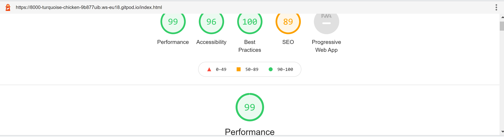
- Menu
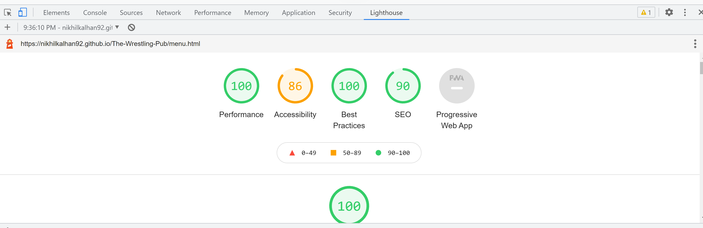
- Contact
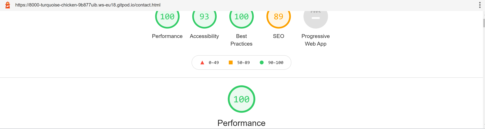

### Responsive Tools
1. I used Am I Responsive to make sure that all my pages are responsive to all devices. Results are below

### W3C Validator Tools
W3C Markup was used to check for any errors within my HTML pages.

- HTML Index Results - no errors
  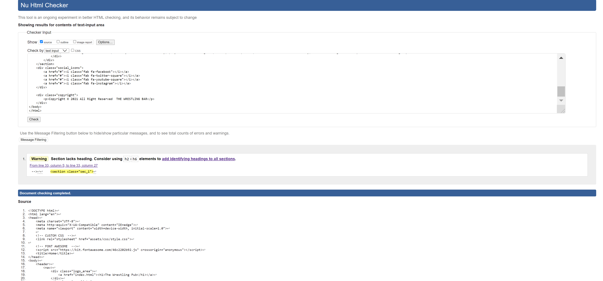
- HTML Menu Results - no errors
 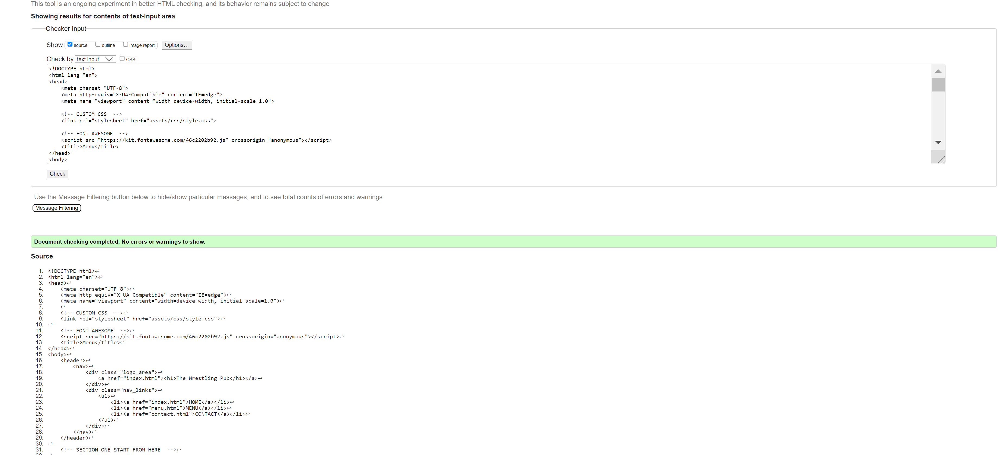
- HTML Contact Results - no erros
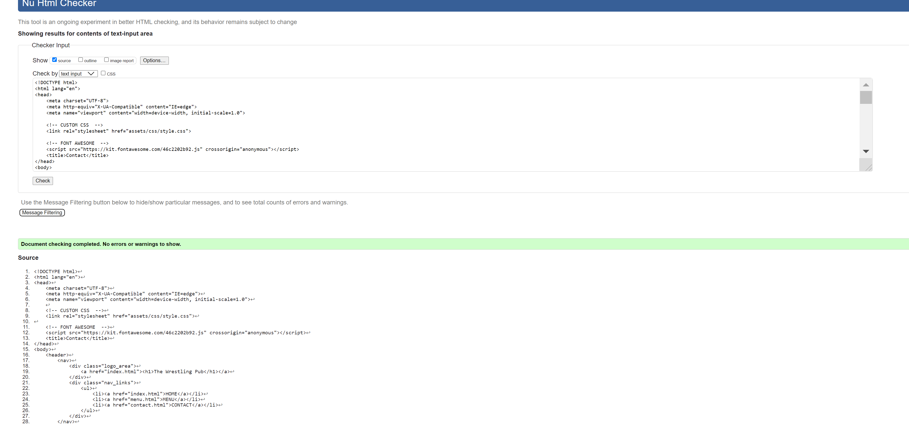
- CSS Results - no errors
 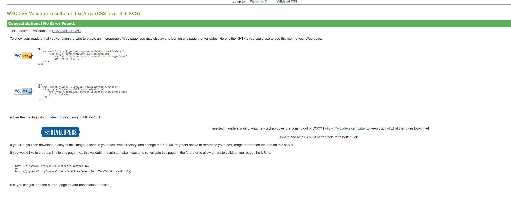

 ### Solved Bugs
 - I had a warning on my HTML Index page. Here it is below. After speaking to student support I realised that section does not need a heading, so it would be ok to leave it whilst explaining on my readme the situation.
 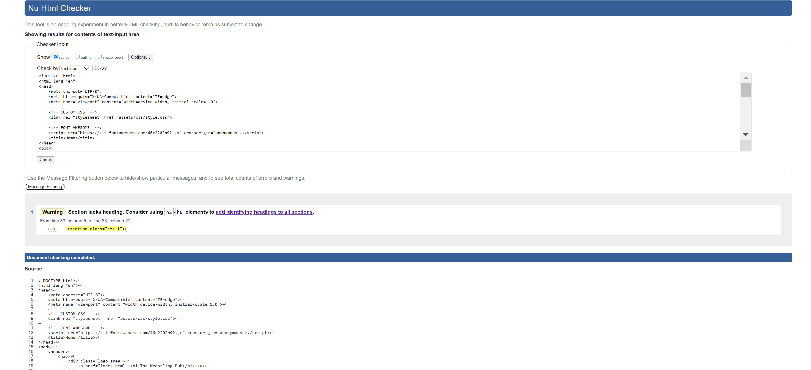

## 4. Manual Testing ##

## User Story Telling ##

### The site needs to be easily accessible.
- Contrasting colours have been used so that content can be read clearly.
### The navigation menu needs to be simple to use on a range of devices, including desktop, tablet and mobile.
- The navigation bar is visible on all pages with an indicator to show which page the user is on.
- The navigation bar is easy to read and easy to understand what each button does.
### Manoeuvring around the site should be simple and straightforward.
- Everything is laid out in a clear manner that is simple to use.
- The navigation bar is clear and visible at the top of each page.
### The site should be informative and all the text should be easy to read.
- All content on each page is clear and easily understandable.
### The images should be clear and not stretched or squashed.
- All images are visibly clear on all pages.
- Only height has been set on images as to maintain the correct aspect ratio.
### Returning User
- The site has detailed information.
- All information is clear and easy to read.
### To get in contact with us
- Navigation bar is visible at the top of each page.
- Site layout allows familar users of the site to find the contact us page.

**Manual Testing**

I have tested my site on multiple devices. These include:

- Galaxy S5 (360 x 640)
- iPhone 6/7/8 (375 x 667)
- iPhone 6/7/8 plus (414 x 736)
- ipad (768 x 1024)
- iPhone XS Max
- iPad Pro (1024 x 1366)
- Huawei P20 Pro
- Please find below my testing process for all pages via mobile and web:

**Styling and Layout**
1. Ensure carousel images loads correctly and functioning as expected.
2. Ensure all images loads correctly. 
3. Ensure all backgrounds images load correctly.
4. Ensure main page hearder loads correctly.

**Navigation Bar**
1. Click on The Wrestling Pup main page header to take us to the Home page from the Home page.
2. Click on The Wrestling Pub main page header to take us to the Home page from The Big Three page.
3. Click on The Wrestling Pub main page header to take us to the Home page from the Contact Us page.
4. Click on Home button to take us to the Home page from the Home page.
5. Click on Home button to take us to the Home page from the History page.
6. Click on Home button to take us to the Home page from the Contact Us page.
7. Click on Menu to take us to Menu from the Home page.
8. Click on Menu to take us to Menu from the Menu.
9. Click on Menu to take us to Menu from the Contact Us page.
10. Click on the Contact Us button to take us to the Contact Us page from the Home page.
11. Click on the Contact Us button to take us to the Contact Us page from the Menu page.
12. Click on the Contact Us button to take us to the Contact Us page from the Contact Us page.

**Pages**
1. Ensure all Navigation links are working in the Home page.
2. Ensure all Navigation links are working in the Menu page.
3. Ensure all Navigation links are working in the Contact Us page.
4. Ensure all Footer links are working in the Home page.
5. Ensure all Footer links are working in the Menu page.
6. Ensure all Footer links are working in the Contact page.

**Responsiveness**
1. Ensure all Images and Content are responsive in the Home page.
2. Ensure all Images and Content are responsive in the Menu.
3. Ensure all Images and Content are responsive in the Contact Us page.
4. Ensure all Text Content is readable in the Home page.
5. Ensure all Text Content is readable in the Menu page.
6. Ensure all Text Content is readable in the Contact Us page.

**Deployment** 

I used GitHub pages to deploy my final project. To do this I had to:
1. Login or Sign Up to [GitHub] - https://github.com/nikhilkalhan92/The-Wrestling-Pub
2. Create a new repository named "MS1-Project - The Wrestling Pub".
3. Once created, click on "Settings" on the navigation bar under the repository title.
4. Choose which folder to deploy from, I used "/root".
5. Click "Save", then wait for it to be deployed. 
6. The URL will be displayed above the "source" section in GitHub Pages.

**Final Website**

Home
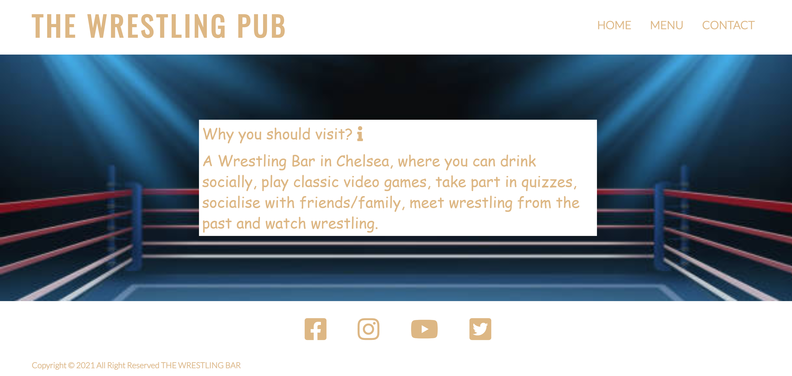
Menu

Contact
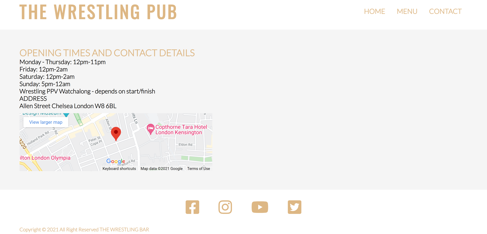

**How to fork a Respiratory**

If you need to make a copy of a repository:

1. Login or Sign Up to GitHub.
2. On GitHub, go to nikhilkalhan92/MS1-Project.
3. In the top right corner, click "Fork".

**How to make a local clone**

If you need to make a local clone:

1. Login in to GitHub.
2. Under the repository name, above the list of files, click "Code".
3. Here you can either Clone or Download the repository.
4. You should close the repository using HTTPS, clicking on the icon to copy the link.
5. Open Git Bash.
6. Change the current working directory to the new locaiton, where you want the cloned directory to be.
7. Type git clone and then paste the URL you copied in step 4.
8. Press Enter, and your local clone will be created.

## 5. Content

### Images
Images are provided by Google Images - I have provided the links

https://www.wwe.com/f/styles/og_image/public/2020/04/EasterBunny_Thumb1--eac98896cfd9d059ec4683ae3cd9c145.jpg

https://www.dartdesign.in/images/portfolio/wwe_1.jpg

https://media.istockphoto.com/vectors/empty-wrestling-sport-arena-boxing-ring-dramatic-sports-vector-vector-id938635868?k=6&m=938635868&s=612x612&w=0&h=qwI-UZ-GDmF-kpgk9SlgZMOAU3SUN3bsfBELudXEowU=

https://www.dartdesign.in/images/portfolio/wwe_2.jpg

https://www.colorcombos.com/colors/F5F5F5

https://www.color-name.com/burlywood.color

## 6. Acknowledgments:

